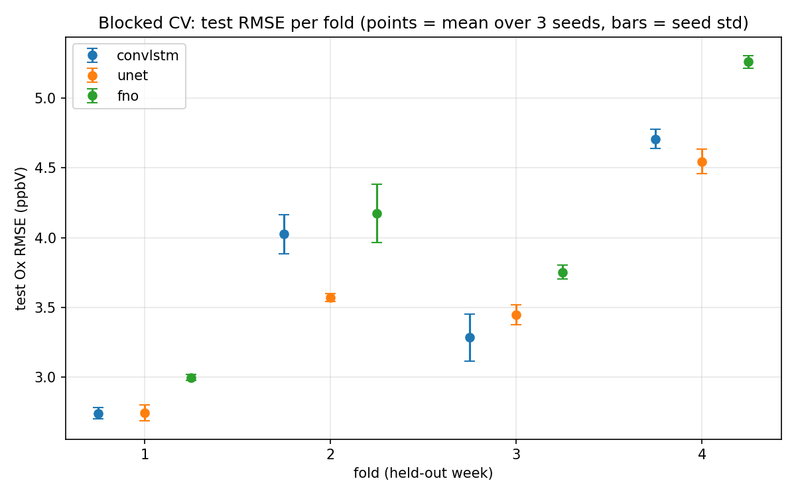

# EQUATES pilot: blocked cross-validation (4 folds x 3 seeds)

Each fold holds out a different week of July as `test` (with a 5-day `val` block and 1-day buffers separating train/val/test), so the number below is a mean +/- spread over four different weather regimes and three seeds (12 runs per model), not one number from one episode. See configs/data/equates_2019_07_ca12km_fold{1..4}.yaml for the exact day blocks.

## Per-fold mean (over 3 seeds), test Ox RMSE (ppbV)

| model | fold 1 | fold 2 | fold 3 | fold 4 | mean of folds | fold std |
|---|---|---|---|---|---|
| convlstm | 2.743 | 4.025 | 3.285 | 4.707 | 3.690 | 0.743 |
| unet | 2.747 | 3.570 | 3.449 | 4.546 | 3.578 | 0.641 |
| fno | 2.998 | 4.173 | 3.754 | 5.258 | 4.046 | 0.817 |

## All 12 runs per model (4 folds x 3 seeds), test Ox RMSE (ppbV)

| model | mean | std | min | max | n |
|---|---|---|---|---|---|
| convlstm | 3.690 | 0.752 | 2.687 | 4.804 | 12 |
| unet | 3.578 | 0.645 | 2.668 | 4.623 | 12 |
| fno | 4.046 | 0.824 | 2.975 | 5.303 | 12 |

## mae (mean +/- std over all 12 runs per model)

| model | mean | std |
|---|---|---|
| convlstm | 2.745 | 0.629 |
| unet | 2.637 | 0.536 |
| fno | 2.922 | 0.644 |

## bias (mean +/- std over all 12 runs per model)

| model | mean | std |
|---|---|---|
| convlstm | -0.391 | 1.721 |
| unet | -0.421 | 1.384 |
| fno | -0.329 | 1.615 |

## pearson_r (mean +/- std over all 12 runs per model)

| model | mean | std |
|---|---|---|
| convlstm | 0.949 | 0.009 |
| unet | 0.946 | 0.009 |
| fno | 0.932 | 0.016 |

## RMSE by fold, all models

