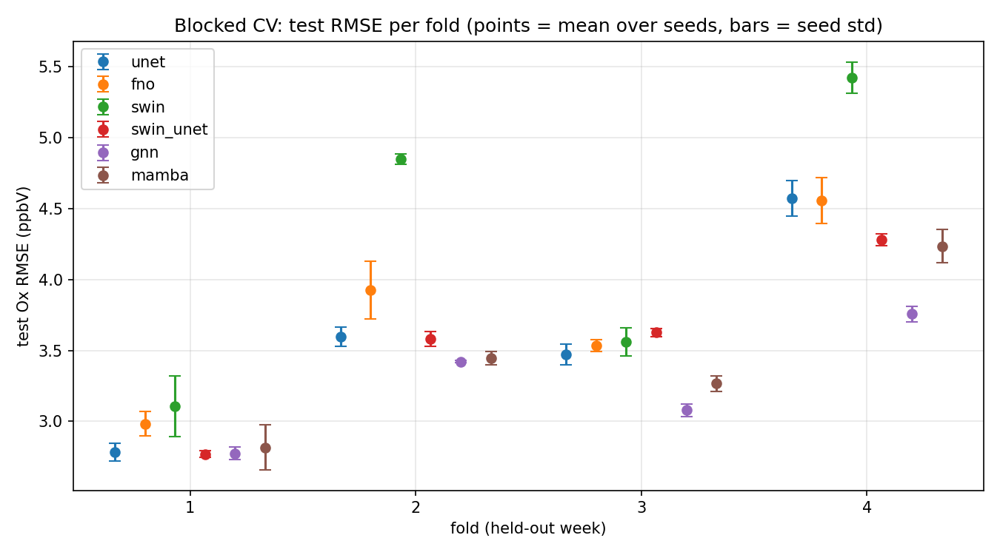

# EQUATES pilot: blocked cross-validation (4 folds x 3 seeds, ox target mode, run_id timestamped 20260929 only)

Each fold holds out a different week of July as `test` (with a 5-day `val` block and 1-day buffers separating train/val/test), so the number below is a mean +/- spread over four different weather regimes and three seeds (up to 12 runs per model), not one number from one episode. See configs/data/equates_2019_07_ca12km_fold{1..4}.yaml for the exact day blocks. Models with fewer than 4 folds present are still in progress.

## Per-fold mean (over 3 seeds), test Ox RMSE (ppbV)

| model | fold 1 | fold 2 | fold 3 | fold 4 | mean of folds | fold std |
|---|---|---|---|---|---|
| unet | 2.782 | 3.597 | 3.471 | 4.572 | 3.605 | 0.638 |
| fno | 2.984 | 3.926 | 3.535 | 4.555 | 3.750 | 0.573 |
| swin | 3.106 | 4.847 | 3.558 | 5.423 | 4.234 | 0.938 |
| swin_unet | 2.770 | 3.581 | 3.625 | 4.279 | 3.564 | 0.535 |
| gnn | 2.775 | 3.421 | 3.078 | 3.757 | 3.258 | 0.368 |
| mamba | 2.817 | 3.445 | 3.266 | 4.235 | 3.441 | 0.512 |

## All runs per model (up to 4 folds x 3 seeds), test Ox RMSE (ppbV)

| model | mean | std | min | max | n |
|---|---|---|---|---|---|
| unet | 3.605 | 0.644 | 2.726 | 4.714 | 12 |
| fno | 3.750 | 0.589 | 2.866 | 4.742 | 12 |
| swin | 4.234 | 0.947 | 2.907 | 5.537 | 12 |
| swin_unet | 3.564 | 0.537 | 2.738 | 4.324 | 12 |
| gnn | 3.258 | 0.370 | 2.737 | 3.801 | 12 |
| mamba | 3.441 | 0.523 | 2.657 | 4.403 | 12 |

## mae (mean +/- std over all runs per model)

| model | mean | std |
|---|---|---|
| unet | 2.674 | 0.552 |
| fno | 2.706 | 0.467 |
| swin | 3.274 | 0.799 |
| swin_unet | 2.542 | 0.363 |
| gnn | 2.286 | 0.239 |
| mamba | 2.412 | 0.373 |

## bias (mean +/- std over all runs per model)

| model | mean | std |
|---|---|---|
| unet | -0.420 | 1.435 |
| fno | -0.192 | 1.132 |
| swin | -0.437 | 2.310 |
| swin_unet | -0.125 | 0.580 |
| gnn | -0.067 | 0.909 |
| mamba | -0.363 | 0.935 |

## pearson_r (mean +/- std over all runs per model)

| model | mean | std |
|---|---|---|
| unet | 0.946 | 0.009 |
| fno | 0.936 | 0.013 |
| swin | 0.937 | 0.016 |
| swin_unet | 0.939 | 0.013 |
| gnn | 0.952 | 0.007 |
| mamba | 0.947 | 0.010 |

## RMSE by fold, all models

