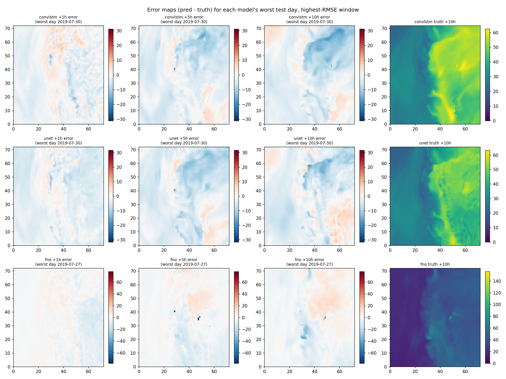

# EQUATES pilot diagnosis

## Train vs test mean Ox

Mean Ox: train days = 27.029 ppbV, val days = 29.854 ppbV, test days = 31.563 ppbV (native units, domain- and hour-mean).

## RMSE by test day and lead hour (ppbV)

### convlstm

| day | +1h | +2h | +3h | +4h | +5h | +6h | +7h | +8h | +9h | +10h | mean |
|---|---|---|---|---|---|---|---|---|---|---|---|
| 2019-07-27 | 2.77 | 2.99 | 3.24 | 3.45 | 3.62 | 3.75 | 3.88 | 3.99 | 4.09 | 4.18 | 3.60 |
| 2019-07-28 | 2.65 | 3.05 | 3.39 | 3.66 | 3.86 | 4.03 | 4.16 | 4.27 | 4.35 | 4.42 | 3.78 |
| 2019-07-29 | 2.14 | 2.37 | 2.65 | 2.89 | 3.09 | 3.25 | 3.40 | 3.53 | 3.66 | 3.78 | 3.08 |
| 2019-07-30 | 2.62 | 2.97 | 3.31 | 3.63 | 3.89 | 4.12 | 4.31 | 4.48 | 4.63 | 4.78 | 3.87 |
| 2019-07-31 | 2.45 | 2.73 | 3.01 | 3.24 | 3.44 | 3.62 | 3.82 | 4.02 | 4.23 | 4.46 | 3.50 |

Negative Ox predictions: 0 / 5443200 (0.000%), min predicted value 9.549 ppbV.

### unet

| day | +1h | +2h | +3h | +4h | +5h | +6h | +7h | +8h | +9h | +10h | mean |
|---|---|---|---|---|---|---|---|---|---|---|---|
| 2019-07-27 | 3.13 | 3.40 | 3.64 | 3.80 | 4.00 | 4.13 | 4.20 | 4.20 | 4.30 | 4.55 | 3.93 |
| 2019-07-28 | 3.07 | 3.45 | 3.76 | 3.96 | 4.14 | 4.20 | 4.23 | 4.26 | 4.41 | 4.54 | 4.00 |
| 2019-07-29 | 2.87 | 3.22 | 3.43 | 3.59 | 3.79 | 3.83 | 3.85 | 3.87 | 4.01 | 4.12 | 3.66 |
| 2019-07-30 | 3.24 | 3.50 | 3.77 | 3.97 | 4.16 | 4.28 | 4.41 | 4.47 | 4.74 | 4.92 | 4.14 |
| 2019-07-31 | 2.83 | 3.04 | 3.27 | 3.40 | 3.69 | 3.86 | 4.08 | 4.25 | 4.44 | 4.70 | 3.76 |

Negative Ox predictions: 0 / 5443200 (0.000%), min predicted value 4.618 ppbV.

### fno

| day | +1h | +2h | +3h | +4h | +5h | +6h | +7h | +8h | +9h | +10h | mean |
|---|---|---|---|---|---|---|---|---|---|---|---|
| 2019-07-27 | 3.07 | 3.65 | 4.06 | 4.51 | 4.85 | 5.10 | 5.41 | 5.71 | 5.99 | 6.34 | 4.87 |
| 2019-07-28 | 2.84 | 3.51 | 3.93 | 4.38 | 4.67 | 4.82 | 4.95 | 5.16 | 5.33 | 5.43 | 4.50 |
| 2019-07-29 | 2.27 | 2.77 | 2.99 | 3.37 | 3.59 | 3.76 | 3.88 | 4.06 | 4.16 | 4.40 | 3.52 |
| 2019-07-30 | 2.63 | 3.23 | 3.69 | 4.21 | 4.56 | 4.79 | 4.91 | 5.12 | 5.22 | 5.45 | 4.38 |
| 2019-07-31 | 2.39 | 2.97 | 3.41 | 3.65 | 3.79 | 3.86 | 3.89 | 3.97 | 4.07 | 4.23 | 3.62 |

Negative Ox predictions: 28 / 5443200 (0.001%), min predicted value -12.996 ppbV.

## Error maps, worst test day per model

## Parameters and FLOPs (single window, batch=1, full 10-hour forecast)

| model | parameters | GFLOPs |
|---|---|---|
| convlstm | 4,813,721 | 747.734 |
| unet | 4,824,726 | 4.531 |
| fno | 4,792,010 | 0.944 |

## FNO spectral ratio and positional embedding

Spectral ratio (test, Ox): +1h: 0.520, +5h: 0.173, +10h: 0.100.

FNO's positional_embedding is explicitly set to None in src/aerocast/models/fno.py (off) - the design comment there says the static grid:X/grid:Y channels already carry normalized coordinates, so it isn't needed.

All three are below 1, meaning FNO's forecasts are smoother/blurrier than truth at every lead checked, and get smoother at longer leads (0.52 -> 0.17 -> 0.10) - consistent with FNO also having the worst RMSE/MAE of the three models here. This is unlikely to be the position-grid setting (it's off, matching the documented design), and more likely reflects the 12.5% domain padding plus low mode count (16x16) relative to how little training data there is (489 windows), so the model favors the low-frequency modes it can estimate reliably.
