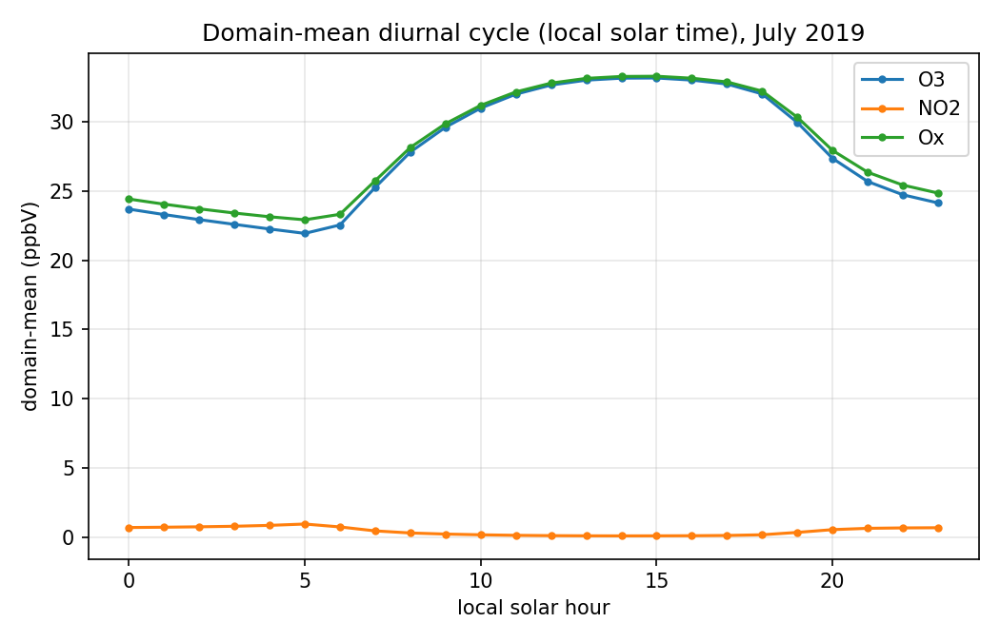
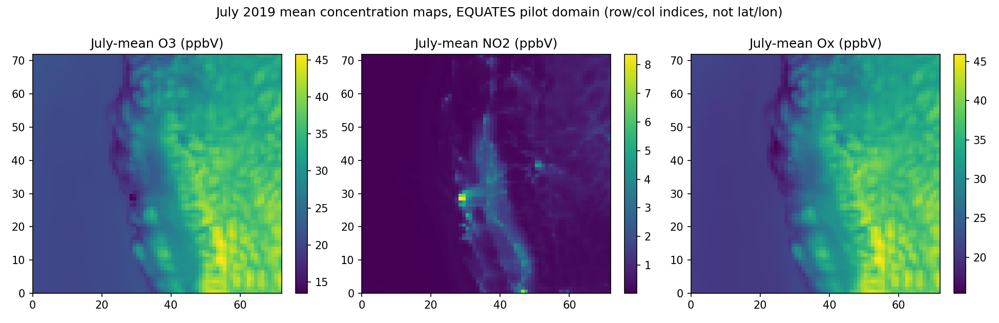

# EQUATES pilot checks

31 days, 744 hours, grid 72x72.

## Timestamp alignment

All streams share all 24 hours on every day (identical TFLAG timestamps after alignment).

## Value checks

| channel | NaNs | negative count | min | max | plausible range |
|---|---|---|---|---|---|
| conc:NO | 0 | 0 | 0.000 | 83.377 | 0-200 ppbV [OK] |
| conc:NO2 | 0 | 0 | 0.001 | 33.053 | 0-150 ppbV [OK] |
| conc:ATOTIJ | 0 | 0 | 0.013 | 86.584 | 0-200 ug/m3 [OK] |
| conc:O3 | 0 | 0 | 0.010 | 162.933 | 0-150 ppbV [OUT OF RANGE] |
| meteo:TEMP2 | 0 | 0 | 274.768 | 320.540 | 250-330 K [OK] |
| meteo:WSPD10 | 0 | 0 | 0.001 | 17.635 | 0-30 m/s [OK] |
| meteo:U10 | 0 | 636715 | -10.215 | 13.469 | - |
| meteo:V10 | 0 | 2663760 | -16.734 | 13.812 | - |
| meteo:PBL | 0 | 0 | 28.321 | 5355.569 | 0-4000 m [OUT OF RANGE] |
| meteo:RGRND | 0 | 0 | 0.000 | 1134.993 | 0-1200 W/m2 [OK] |
| meteo:Q2 | 0 | 0 | 0.001 | 0.018 | 0-0.03 kg/kg [OK] |
| time:HOUR_SIN | 0 | 1928448 | -1.000 | 1.000 | - |
| time:HOUR_COS | 0 | 1928448 | -1.000 | 1.000 | - |

Total NaNs across all channels: 0.

## Diurnal cycle

O3 peaks at local hour 15:00, NO2 peaks at local hour 5:00 (domain mean over the whole read area, so urban NO2 morning-peak and rural/mixed O3 afternoon-peak signals are blended together, not separated by land use).

## July-mean maps

NO emissions map skipped: this pilot has no emissions stream (see DATA_CARD.md 'Known gaps' - the only 2019 gridded emissions found on AWS cover 10 scattered July days, not the full month).

O3 is higher in the south of the domain than the north (mean 25.9 vs 28.5 ppbV in the north/south 8-cell edge strips); NO2 is higher in the south similarly (mean 0.3 vs 0.4 ppbV). This reflects the mix of urban (Bay Area/Sacramento) and rural/valley cells in the read area, not a single clean urban-vs-rural gradient - see the map for the actual spatial pattern rather than assuming a textbook NO2-source/O3-downwind split.
